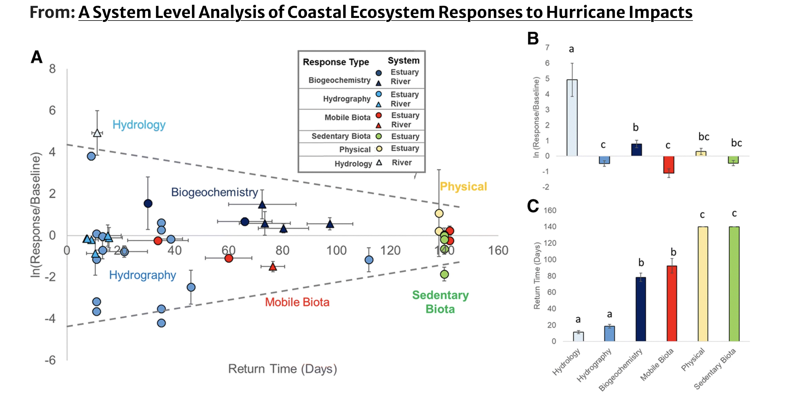

```{r setup, include=FALSE}
knitr::opts_chunk$set(echo = F,
                      warning = F,
                      message = F)
```

```{r Setup and data prep}
## Load setup script
source("../scripts/0_0_setup.R")

library(ggallin)

## Make a small helper script to format each dataset when reading in
prep_csvs <- function(path){
  read_csv(path) %>% 
    mutate(datetime_est = force_tz(datetime_est, tzone = common_tz)) %>% 
    mutate(plot = case_when(plot == "Seawater" ~ "Estuarine", 
                            TRUE ~ plot))
}

## Load processed datasets. Note that we should only use datetime_est
teros <- prep_csvs("../data/240326_teros_final.csv")
firesting <- prep_csvs("../data/240318_firesting_final.csv")
swap <- prep_csvs("../data/240404_swap_final.csv") %>% 
  rename("depth" = depth_cm)

```

### Purpose

This script is used to calculate resistance and recovery metrics, as described by [Patrick et al. 2020](https://link.springer.com/article/10.1007/s12237-019-00690-3) for VWC, DO, and Eh. The ultimate goal is to construct a plot similar to Figure 2: 


Resistance is calculated as the natural log of Response (Vdist) / Baseline (Vpre). Return is defined as the time when values return to Baseline values. 


### Initial data visualization

These are our raw datasets that we will use to calculate our resistance and recovery metrics (y and x axes in Figure 2, respectively). We will not calculate these values for the control plot because there were no clear disturbances in trends.

```{r}
initial_plots <- function(data, var){
  ggplot(data, aes(datetime_est, {{var}}, color = as.factor(depth))) + 
    geom_line(show.legend = F) + 
    geom_vline(xintercept = dump_start1, linetype = "dashed") + 
    geom_vline(xintercept = dump_start2, linetype = "dashed") + 
    facet_wrap(~plot, ncol = 1) 
}

plot_grid(initial_plots(teros, vwc), 
          initial_plots(firesting, do_percent_sat),
          initial_plots(swap, eh_mv),
          nrow = 1)
```

```{r make one long dataset}

common_cols <- c("datetime_est", "plot", "depth", "var", "value")

df_raw <- bind_rows(teros %>% 
                      mutate(var = "vwc") %>% 
                      rename("value" = vwc) %>% 
                      dplyr::select(all_of(common_cols)), 
                    firesting %>% 
                      mutate(var = "do_percent_sat") %>% 
                      rename("value" = do_percent_sat) %>% 
                      dplyr::select(all_of(common_cols)), 
                    swap %>% 
                      mutate(var = "eh_mv") %>% 
                      rename("value" = eh_mv) %>% 
                      dplyr::select(all_of(common_cols))) %>% 
  filter(plot != "Control")

```

First step: label time-periods. We will calculate Vpre from period of data immediately before start of the first flood. Since redox sensors were installed later than DO (and VWC are permanently installed), we will trim all time-series to the last sensor installed prior to Vpre calculations: 

```{r label time-periods}

## Redox are all trimmed to "2023-06-05 17:40:00" so we'll use that as the start for our Vpre
df_raw %>% 
  ungroup() %>% 
  group_by(plot, depth, var) %>% 
  summarize(start_datetime = min(datetime_est)) 

vpre_start = as.POSIXct("2023-06-05 17:40:00", tz = common_tz)

df_labeled <- df_raw %>% 
  filter(datetime_est >= vpre_start) %>% 
  mutate(time_period = case_when(
    datetime_est < as_datetime("2023-06-06 05:00:00", tz = common_tz) ~ "Vpre",
    datetime_est <= as_datetime("2023-06-07 15:00:00", tz = common_tz) ~ "Flood", 
    datetime_est > as_datetime("2023-06-07 15:00:00", tz = common_tz) ~ "Post-flood")) 

```

### Plots: assign time-periods {.tabset}

```{r results='asis'}

plot_periods <- function(selected_var){
  ggplot(df_labeled %>% filter(var == selected_var), 
       aes(datetime_est, value, group = depth, color = time_period)) + 
  geom_line() + 
  facet_wrap(plot~time_period)
}

selected_vars = unique(df_labeled$var)

for (i in 1:length(selected_vars)){
  cat(paste("####", selected_vars[[i]]))
  cat("\n")
  print(plot_periods(selected_vars[[i]]))
  cat("\n\n")
}

```

###

```{r calculate vpre stats}

vpre_stats <- df_labeled %>% 
  filter(time_period == "Vpre") %>% 
  group_by(plot, depth, var) %>% 
  summarize(vpre_mean = mean(value, na.rm = T), 
            vpre_sd = sd(value, na.rm = T))

vpre_stats
```

```{r determine if vdist is increase or decrease}

mins_and_maxes <- df_labeled %>% 
  filter(time_period == "Flood") %>%  # This version only includes the beginning of Flood 1 to the end of Flood 2
  #filter(grepl("lood", time_period)) %>% # This version includes everything after the start of Flood 1
  group_by(plot, depth, var) %>% 
  summarize(event_min = min(value, na.rm = T), 
            event_max = max(value, na.rm = T))

mins_maxes_and_times <- mins_and_maxes %>%
  left_join(df_labeled %>% 
  filter(time_period == "Flood"), 
  #filter(grepl("lood", time_period)), 
  by = c("plot", "depth", "var")) %>%
  group_by(plot, depth, var) %>%
  summarize(event_min = first(event_min), 
            event_min_time = first(datetime_est[value == event_min]), 
            event_max = first(event_max), 
            event_max_time = first(datetime_est[value == event_max])) 

vdist <- inner_join(vpre_stats, mins_maxes_and_times, 
                          by = c("plot", "depth", "var")) %>% 
  mutate(direction = ifelse(abs(event_min - vpre_mean) > abs(event_max - vpre_mean), 
                       "decrease", "increase")) %>% 
  mutate(vdist = ifelse(abs(event_min - vpre_mean) > abs(event_max - vpre_mean), 
                       event_min, event_max)) %>% 
  mutate(vdist_time = as_datetime(ifelse(abs(event_min - vpre_mean) > abs(event_max - vpre_mean), 
                       event_min_time, event_max_time), tz = common_tz)) %>% 
  mutate(baseline = ifelse(abs(event_min - vpre_mean) > abs(event_max - vpre_mean), 
                       vpre_mean - vpre_sd, vpre_mean + vpre_sd))

```

### Plots: check increase/decrease and event_min/event_max {.tabset}

Circles are event maxima, and triangles are event minima


```{r results='asis'}

plot_vdist <- function(selected_var){
  
  df_trim <- df_labeled %>% 
           filter(var == selected_var)
  
  vdist_trim <- vdist %>% 
    filter(var == selected_var)
  
  ggplot() + 
    geom_line(data = df_trim, 
              aes(x = datetime_est, 
                  y = value, 
                  color = as.factor(depth))) + 
    geom_point(data = vdist_trim,
               aes(x = event_min_time, 
                   y = event_min, 
                   color = as.factor(depth)), 
               size = 3, alpha = 0.6, pch = 17) +
        geom_point(data = vdist_trim,
               aes(x = event_max_time, 
                   y = event_max, 
                   color = as.factor(depth)), 
               size = 3, alpha = 0.6, pch = 19) +
    facet_wrap(~plot, ncol = 1)
}

selected_vars = unique(df_labeled$var)

for (i in 1:length(selected_vars)){
  cat(paste("####", selected_vars[[i]]))
  cat("\n")
  print(plot_vdist(selected_vars[[i]]))
  cat("\n\n")
}

```


```{r calculate log response ratio as ln(vdist/vpre)}

lrr <- vdist %>% 
  mutate(event_min = ifelse(event_min == 0, 0.1, event_min)) %>% 
  mutate(lrr = case_when(direction == "increase" ~ log(event_max / vpre_mean), 
                         direction == "decrease" ~ log(event_min / vpre_mean), 
                         TRUE ~ NA))
```

### Plots: look at log-response ratios calculations {.tabset}

```{r results='asis'}

ggplot(lrr, aes(as.factor(depth), lrr, fill = var)) + 
  geom_col(position = position_dodge(preserve = "single")) + 
  scale_x_discrete(limits=rev) + 
  coord_flip() + 
  geom_hline(yintercept = 0) + 
  facet_wrap(plot~var, scales = "free_x") 


```

These are our resistance values, and the seem sensible. Because of the order-of-magnitude differences between our variables (0-100, 200-800, and 0.2-0.4), things are very different magnitudes of lrr. The TSLA way is to normalize prior, which allows us to apples-to-apples **between** plots, but removes the ability to compare between variables.

Next, let's calculate our return times. This is going to be the first value after vdist that returns to baseline. 

```{r}

## First, trim each dataset to only include datetimes after vdist. Then, find the first value that intersects the baseline
df_trim_for_returns <- df_labeled %>% 
  left_join(vdist %>% 
              dplyr::select(plot, depth, var, direction, baseline, vdist, vdist_time), 
            by = c("plot", "depth", "var")) %>% 
  ungroup() %>% 
  group_by(plot, depth, var) %>% 
  filter(datetime_est > vdist_time) 

#df_trim_for_returns

return_times_raw <- df_trim_for_returns %>%
  group_by(plot, depth, var, direction) %>%
  filter(ifelse(direction == "decrease", value >= baseline, value <= baseline)) %>%
  summarize(return_time = min(datetime_est))

return_times <- lrr %>% 
  left_join(return_times_raw %>% 
              dplyr::select(plot, depth, var, return_time), 
            by = c("plot", "depth", "var")) %>% 
  mutate(return_time = ifelse(is.na(return_time), 
                              as.numeric(post_event_end - vdist_time, units = "hours"), 
                              as.numeric(return_time - vdist_time, units = "hours")))
```


```{r make the plot!}

ggplot(return_times, 
       aes(return_time, lrr, 
           size = as.factor(depth), 
           color = var, 
           pch = plot)) + 
  geom_point(alpha = 0.8) + 
  scale_y_continuous(trans = pseudolog10_trans) + 
  labs(x = "Return Time (hrs)", 
       y = "ln(Response/Baseline)", 
       size = "Depth (cm)", 
       color = "Variable", 
       shape = "Plot")

ggsave("figures/240503_return_v_resistance.png", 
       width = 6, height = 5)
```

### Figure 5

Because things didn't pan out as we expected (largely due to not having long enough time-series to capture returns), we'll focus on resistance

```{r}
plot_resistance <- function(selected_var){
  
  df <- lrr %>% 
    filter(var == selected_var)
  
  dodge_width = 5
  
  ggplot(data = df, aes(depth, lrr, color = plot)) +
    geom_hline(yintercept = 0, linetype = "dashed") +
    geom_linerange(aes(ymin = 0, ymax = lrr), position = position_dodge(width = dodge_width)) +
    geom_point(position = position_dodge(width = dodge_width), size = 3) +
    coord_flip() +
    scale_x_reverse() +
    labs(x = "Depth (cm)", y = "Log response ratio", color = "") +
    scale_color_manual(values = c("#25B163", "#C13E72", "#0DB0AE"))
}

#plot_resistance("vwc")

plot_grid(plot_resistance("vwc") +
            theme(legend.position = "none") +
            ggtitle("VWC (m3/m3)"),
          plot_resistance("do_percent_sat") +
            theme(legend.position = "none") +
            ggtitle("DO (mg/L)"),
          plot_resistance("eh_mv") +
                            theme(legend.position = "none") +
            ggtitle("Eh (mV)"),
          get_legend(plot_resistance("eh_mv")),
          nrow = 1, rel_widths = c(1, 1, 1, 0.4))
ggsave("figures/5_Fig5_resistance.png", width = 10, height = 4)

```

```{r}

## Let's calculate the change in log-response (and Vdist) for Eh with depth

lrr %>% 
  filter(var == "eh_mv") %>% 
ggplot(aes(depth, vpre_mean -vdist)) + 
  geom_point() + 
  geom_smooth(method = "lm", se = F) + 
  facet_wrap(~plot)

lrr %>% 
  filter(var == "eh_mv") %>% 
  ungroup() %>% 
  group_by(plot) %>% 
  summarize(slope = coef(lm((vpre_mean - vdist) ~ depth))[["depth"]])

```


